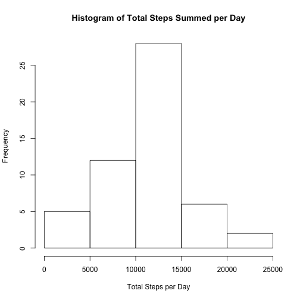
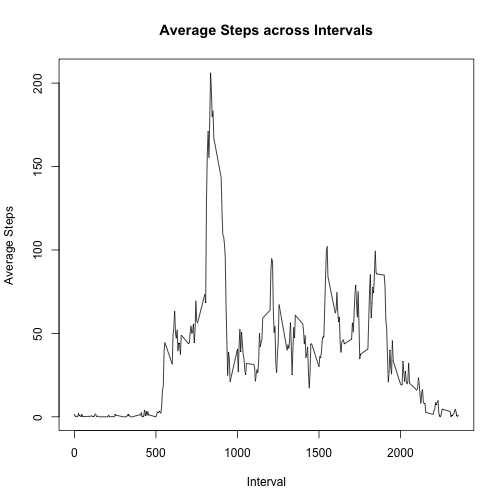
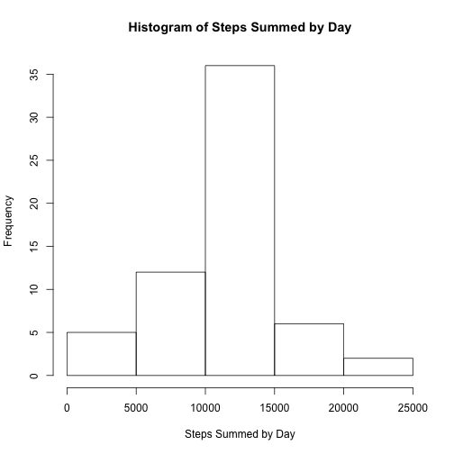
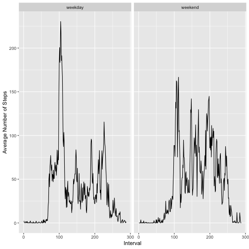

#Reproducible Research Week 2 Project#
##Devin Clarke##  

###Set global options and import packages###  

Setting echo to true to always display the code, and also load ggplot2 if it
isn't already loaded

```r
library(knitr)
opts_chunk$set(echo = TRUE) 

if(!(require("ggplot2"))) {
  install.packages("ggplot2")
  library(ggplot2)
}
```

###Read in the data###  

Read in the activity.csv dataset, speciying that it has a header, missing values
are indicated by 'NA', and define the classes of the steps and date columns as
numeric and Date. We don't define interval as a factor yet as doing so in 
colClasses means we can't pass the argument 'ordered=T' which specifies its a 
factor with inherent ordering, so we do that after we've imported the data

```r
activity = read.csv("activity.csv", header = T, na.strings = "NA", 
                    colClasses = c("numeric", "Date"))
activity$interval = factor(activity$interval, ordered = T)
head(activity)
```

```
##   steps       date interval
## 1    NA 2012-10-01        0
## 2    NA 2012-10-01        5
## 3    NA 2012-10-01       10
## 4    NA 2012-10-01       15
## 5    NA 2012-10-01       20
## 6    NA 2012-10-01       25
```

###Total number of steps per day###  

We calculate the total number of steps per day, ignoring missing values, before
plotting this on a histogram then calculating the mean and median values

```r
stepsDateDF = aggregate(steps ~ date, activity, sum, na.rm = T)
hist(stepsDateDF$steps, xlab = "Total Steps per Day", main = "Histogram of Total Steps Summed per Day")
```



```r
# Mean value
mean(stepsDateDF$steps)
```

```
## [1] 10766.19
```

```r
# Median value
median(stepsDateDF$steps)
```

```
## [1] 10765
```

###Average daily activity pattern###  

We find the mean number of steps per interval, ignoring missing values, then we
plot this as a line graph before finding out which interval contains the maximum
number of steps

```r
stepsIntDF = aggregate(steps ~ interval, activity, mean, na.rm = T)
plot(levels(stepsIntDF$interval), stepsIntDF$steps, type = "l",
     xlab = "Interval", ylab = "Average Steps", main = "Average Steps across Intervals")
```



```r
#Interval with the maximum number of steps
stepsIntDF$interval[which.max(stepsIntDF$steps)]
```

```
## [1] 835
## 288 Levels: 0 < 5 < 10 < 15 < 20 < 25 < 30 < 35 < 40 < 45 < 50 < ... < 2355
```

###Missing data###    

Get out the total number of rows that contain missing data in the object 
totalMissing.  We are going to replace the missing values with the average value 
for the interval that the data is missing from. We create a duplicate of 
activity called noMissing that will have the missing values filled in. To do 
this we match the interval value of the missing row to the interval value in our
data frame of mean steps per interval and replace the NA steps value in 
noMissing with the steps value from the mean steps per interval data frame.  

We then calculate the total number of steps for each day from the data that has
no missing values, and compute the mean and median values from the result.

```r
# Total missing rows
sum(is.na(activity$steps)==T)
```

```
## [1] 2304
```

```r
noMissing = activity
noMissing[is.na(activity$steps), ] = 
merge(stepsIntDF, activity[is.na(activity$steps), 2:3])[, colnames(activity)]

stepsDateDFnoM = aggregate(steps ~ date, noMissing, sum)
hist(stepsDateDFnoM$steps, xlab = "Steps Summed by Day", main = "Histogram of Steps Summed by Day")
```



```r
# Mean of no missing data
mean(stepsDateDFnoM$steps)
```

```
## [1] 10766.19
```

```r
# Median of no missing data
median(stepsDateDFnoM$steps)
```

```
## [1] 10766.19
```
The mean values are the same when comparing the dataset with and without missing
values, but there is a slight increase in the median value when missing values 
are filled in  

###Weeksday and Weekends###

We create a vector that contains the weekdays of our date column, then if the
day is either Saturday or Sunday, we assign it a value of 'weekend', otherwise
it is assigned a value of 'weekday', then this vector is converted to a factor  

We then find the mean steps for each interval split by weekend or weekday, 
before plotting two line graphs that show the average number of steps for each
interval for weekends or weekdays

```r
weekend = c("Saturday", "Sunday")
noMissing$weeksplit = 
  as.factor(ifelse(weekdays(noMissing$date) %in% weekend, 
            "weekend", "weekday"))
weekAvg = aggregate(steps ~ interval + weeksplit, noMissing, mean)
qplot(as.numeric(interval), steps, data = weekAvg, geom = "line", xlab = "Interval", ylab = "Average Number of Steps", facets = .~weeksplit)
```


